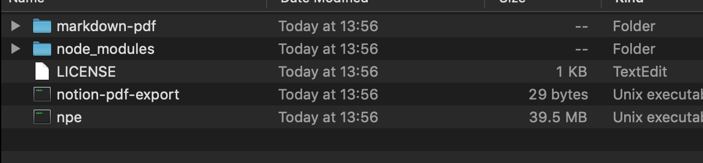
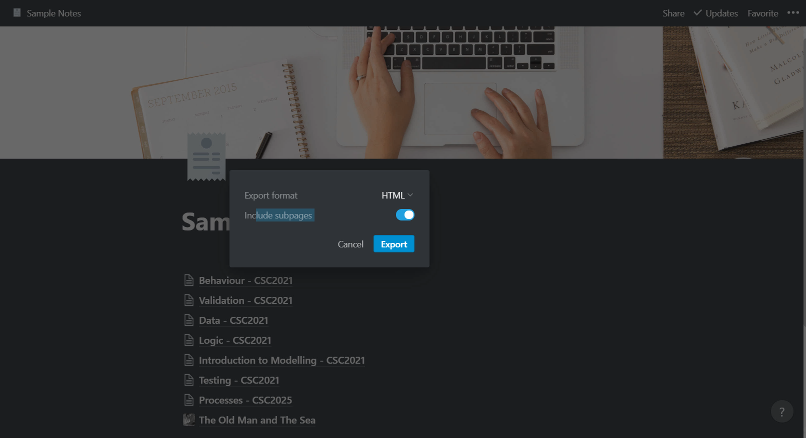
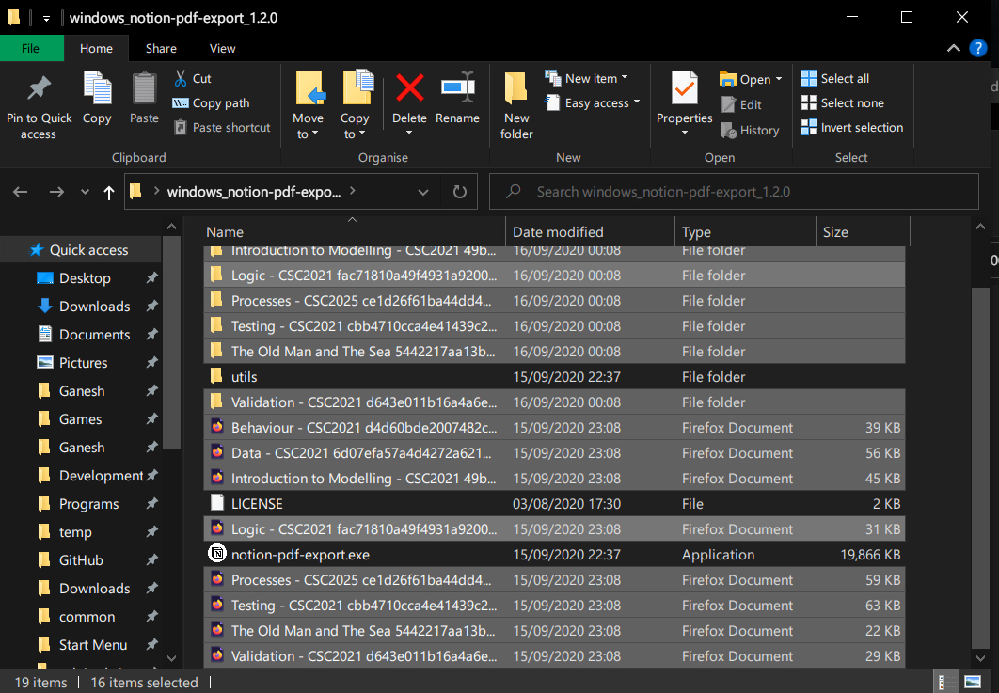
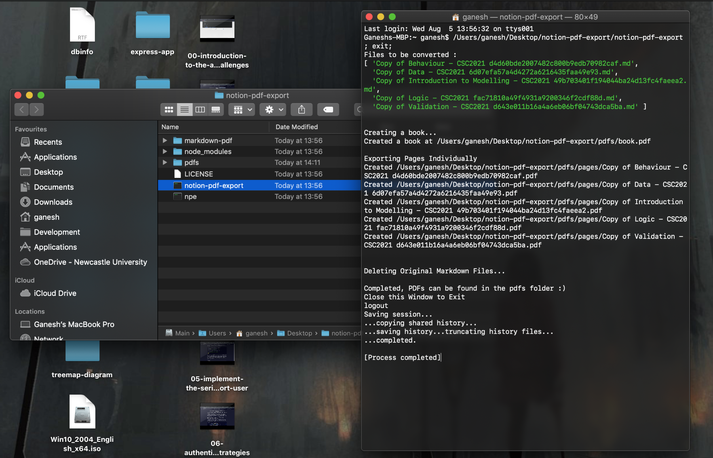
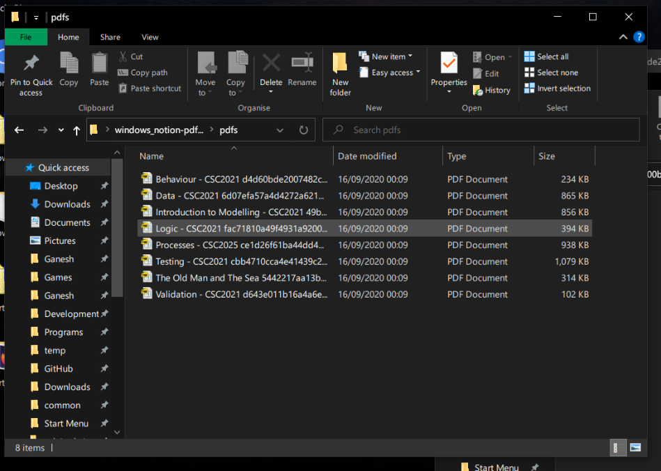

# Notion PDF Export

A tool to allow batch PDF export for free Notion users. You can export as HTML with subpages and then use this tool to convert those into PDFs.


## Download

Get the latest download for Windows and Mac from the releases page:

[https://github.com/ganeshh123/notion-pdf-export/releases](https://github.com/ganeshh123/notion-pdf-export/releases/latest)

[Download for Windows](https://github.com/ganeshh123/notion-pdf-export/releases/download/1.20/windows_notion-pdf-export_1.20.zip)

[Download for Mac](https://github.com/ganeshh123/notion-pdf-export/releases/download/1.20/mac_notion-pdf-export_1.20.zip)

## Usage

1. Download the tool and extract.

    

2. In [Notion](https://notion.so), place all the pages you wish to export into one page and click Export, choose 'HTML' and ensure 'Include Subpages' is on.

    

3. Extract the export to find a list of HTML files and folders for each page. Place the HTML files with folders containing images in the same folder as 'notion-pdf-export.exe' (Windows) or 'notion-pdf-export' (Mac).

    

4. Double Click 'notion-pdf-export.exe' (Windows) or 'notion-pdf-export' (Mac) and wait for the process to be completed.

    

5. All the individual pages can be found converted into PDF Documents inside the pdfs folder.

    

---

## Building

### Running the Project on Node

1. Clone/Download the project and run the command in the project root directory:

    ```bash
    npm install
    ```
2. Run this command to run the script:

    ```bash
    node index.js
    ```

### Compiling an Executable

This is tricky. A lot of adjustments had to be made so that it can run without node.

**Installing nexe**

Executables are compiled with a very [specific version of nexe](https://github.com/cspotcode/nexe/tree/fix-vfs) that allows access to the filesystem, which has a tricky setup procedure.

To install automatically:

Run **install_nexe_win.bat** as admin on **Windows**, will take about 5 minutes to install fully.

Or

Run **install_nexe_mac** on **Mac**, will take about 5 minutes to install, and you will need to enter password. This sometimes doesn't seem to work properly, so might be worth doing manual install if there's problems.

Alternatively, install manually like this:

1. Firstly, install the general [nexe](https://www.npmjs.com/package/nexe) globally with the command:

    ```bash
    npm install -g nexe
    ```

    In Windows with Command Prompt running as Admin. Or:

    ```bash
    sudo npm install -g nexe
    ```

    In Mac in the terminal

2. In the project root folder build some executables with this version of nexe to download node binaries for Windows and Mac:

    ```bash
    nexe . --target win32-x86-10.13.0
    nexe . -t macos-10.13.0
    ```

    This will download the binaries we need for later, delete the executables built with this for now.

3. Now we need to install a [specific version of nexe](https://github.com/cspotcode/nexe/tree/fix-vfs) that allows access to the filesystem:

    Run the command:

    ```bash
    npm install -g cspotcode/nexe#19a5046
    ```

    In Windows with Command Prompt running as Admin. Or:

    ```bash
    sudo npm install -g cspotcode/nexe#19a5046
    ```

Now we should have the correct version of nexe for building.

Confirm by running:

```bash
nexe -v
```


Check that the version is `4.0.0-beta.4`

**Compiling Executables**

To Compile Automatically

Run **build_win32.bat** on **Windows** to build a Windows Executable. This can be found in /dist/win32 and everything in that folder must be distributed together.

Run **build_macos** on **Mac** to build a Mac Executable. This can be found in /dist/macos and everything in that folder must be distributed together.

If you wish to compile for Mac on Windows or Vice Versa, you can do so using the manual method below. This is trickier and will require obtaining a phantomjs binary built for the desired platform and placing it in the correct place.


To Compile Manually

To build a Windows Executable, run the command:
```bash
nexe . --target win32-x86-10.13.0 -o ./dist/win32/notion-pdf-export.exe
```
in the root directory of the project.

To build a Mac executable, run the command:
```bash
nexe . -t macos-10.13.0 -o ./dist/macos/npe
```
in the root directory of the project. Note that this is built under the name 'npe' which is done for a reason.

To distribute the Windows Executable, place it in a directory with the following:

- The original 'utils' folder from the source code


To distribute the Mac Executable (npe), place it in a directorywith the following:

- The original 'utils' folder from the source code
- An executable unix shell script with the following contents, called 'notion-pdf-export':

    ```bash
    #/bin/bash
    cd "$0"/..
    ./npe
    ```

    This can be obtained from 'mac_script.sh' or found inside /dist/macos

## Credits
<a href="https://iconscout.com/icons/notion" target="_blank">Notion Icon</a> by <a href="https://iconscout.com/contributors/Rengised">Alex Martinov</a> on <a href="https://iconscout.com">Iconscout</a>
